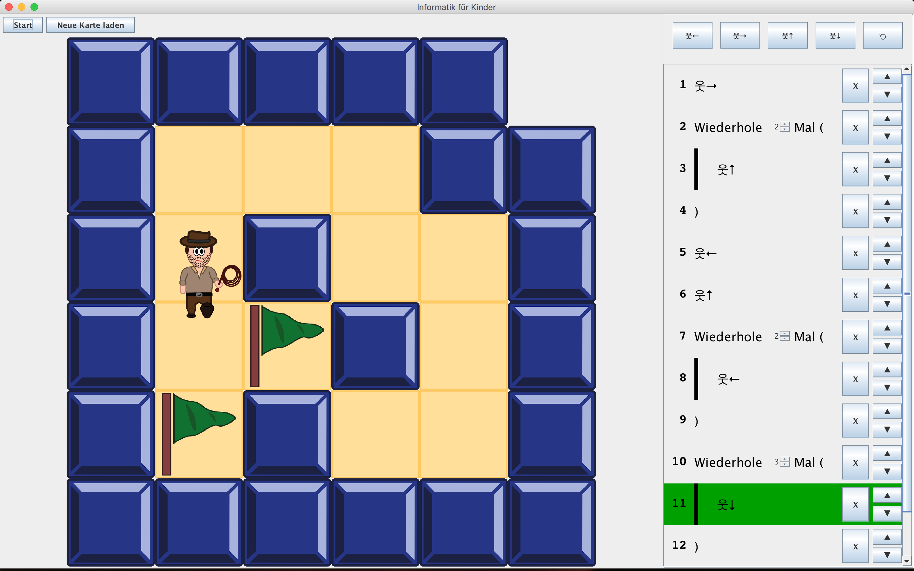
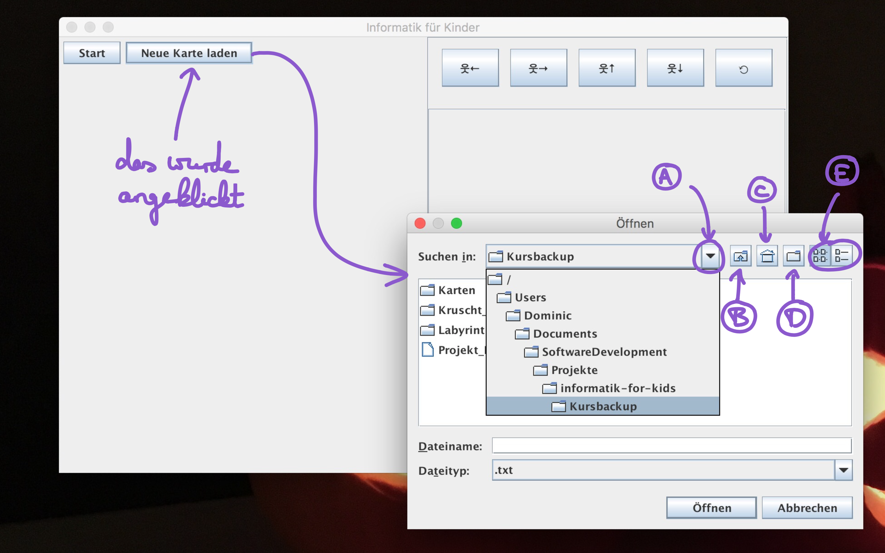

# informatik-for-kids



## Downloads
Die Kursmaterialien finden sich [hier auf Dropbox](https://www.dropbox.com/sh/ugxfb8vwrf0w6id/AAA1F_lzIdWqhoX-0BC4tQUja?dl=0) und werden in Zukunft aktualisiert. Die letzte Aktualisierung war am Samstag, den 25.03.2017. Viel Spaß damit! :)

## Wichtige Informationen zur Verwendung des Programms
Die Software ist das .jar-File und kann per Doppelklick gestartet werden (falls Java auf dem Rechner installiert ist; falls nicht, finden sich weitere Informationen [im Wiki](https://github.com/dominicparga/informatik-for-kids/wiki/Hinweise-zur-Java-Installation)). Im Ordner `Karten` befinden sich die 4 Beispiel-Karten aus dem Kurs. Ich habe sie ein wenig angepasst, damit die Erstellung neuer Karten einfacher wird:
* Eine Karte ist jetzt ein normales txt-File (zum Beispiel `Karte_0.txt`).
* Man muss nicht mehr die Zeilen und Spalten zählen! :)
* Es ist egal, ob man die Buchstaben groß oder klein schreibt. Man kann also für eine Wand zum Beispiel 'w' anstatt "W" schreiben.
* Man darf nur einen Start haben, aber es darf mehrere Ziele geben.

#### Symbole
* `w` für eine Wand (Englisch "wall")
* `g` für Boden (Englisch "ground")
* `s` für Start (English "start")
* `*` für ein Ziel
* `;` ist das Ende einer Zeile
* `,` ist eine Lücke. Hier ist gar kein Feld und das Labyrinth wird hier nachher leer sein.
* Alle anderen Zeichen werden vom Programm ignoriert.

#### Wie lädt man eine neue Karte?
Wenn man auf `Neue Karte laden` drückt, dann öffnet sich ein Fenster, wo man die neue Karte suchen kann. Das nennt sich auf englisch "file chooser", was auf deutsch sowas heißt wie "Datei-Auswahl". Der Vorteil davon ist, dass man alle Dateien auf dem Computer angezeigt bekommt. Man kann die neue Karte also überall auf dem Computer hinlegen (zB auch auf den Desktop) und im `FileChooser` muss man nur noch da hin manövrieren. :)

Für das Manövrieren habe ich dieses Bild gemacht:



| Buchstabe |             Bedeutung          |
|:---------:|--------------------------------|
|    `A`    | anderen Ordner auswählen |
|    `B`    | eine Ordnerebene nach oben gehen (also das Gegenteil von Doppelklicken auf einen Ordner, einfach mal draufklicken :) ) |
|    `C`    | in den Benutzerordner des Computers wechseln; hier kommt man schnell zum Desktop oder zu den eigenen Dateien |
|    `D`    | neuen Ordner im aktuellen Ordner erstellen |
|    `E`    | diese beiden Knöpfe sind nur für die Darstellung des aktuellen Ordners; einfach das anklicken, was einem besser gefällt :) |

## Aktuelle Mitarbeiter

**Dominic Parga Cacheiro**  
ist der Software-Entwickler, Kursleiter und Organisator des Kursinhalts.

## Frühere Mitarbeiter
Manche Leute haben an diesem Projekt mitgearbeitet, aber es gibt keine passende Stelle, um sie zu erwähnen. Daher werden sie hier erwähnt.

**Nicolas Parga Cacheiro**  
hat all die schönen Grafiken erstellt.


## Demonstration and Examples
Demonstrations and examples can be executed using `gradle`. A (somewhat) stable demonstration can be executed from the `master`-branch (see Main UI).

#### Main UI
The main UI provides the possibility to interact with the implemented logic directly. It can be started using

```shell
./gradlew :inforkids-ui:run
```
